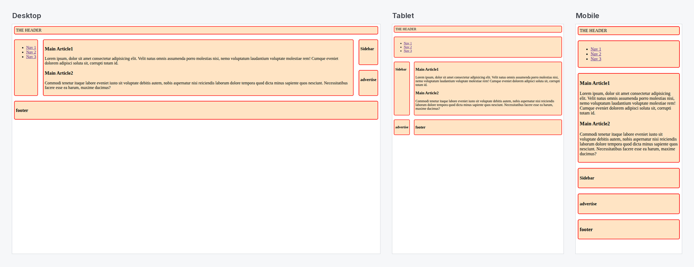

# Responsive Page Layout with CSS Grid Template Areas

A classic page skeleton (header, nav, main, sidebar, advertisement and footer) laid out with **`grid-template-areas`**. It rearranges itself for desktop, tablet and mobile with just two media queries.

[](https://shayan-abrar.github.io/Using-Grid-Easy-method-/) <!-- live-demo -->




## How It Works

Each element gets a named area (`grid-area: header;`, `grid-area: nav;` and so on), and the container "draws" the layout as a map:

```css
/* Desktop: 4 columns */
.container {
  display: grid;
  gap: 20px;
  grid-template-areas:
    "header header  header  header"
    "nav    main    main    sidebar"
    "nav    main    main    advertise"
    "footer footer  footer  footer";
}

/* Tablet: 576px – 992px */
@media screen and (min-width: 576px) and (max-width: 992px) {
  .container {
    grid-template-areas:
      "header    header header"
      "nav       nav    nav"
      "sidebar   main   main"
      "advertise footer footer";
  }
}

/* Mobile: < 576px, one column */
@media screen and (max-width: 576px) {
  .container {
    grid-template-areas: "header" "nav" "main" "sidebar" "advertise" "footer";
  }
}
```

Because the HTML never changes, the whole responsive behavior lives in a few readable lines of CSS.

## Run Locally

```bash
git clone https://github.com/SHAYAN-ABRAR/Using-Grid-Easy-method-.git
cd Using-Grid-Easy-method-
# Open index.html and resize the browser window
```

## Author

**Shayan Abrar** · [GitHub](https://github.com/SHAYAN-ABRAR) · [LinkedIn](https://www.linkedin.com/in/shayan-abrar/) · [Portfolio](https://shayan-abrar.vercel.app)
